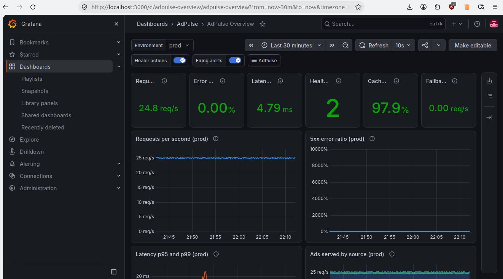
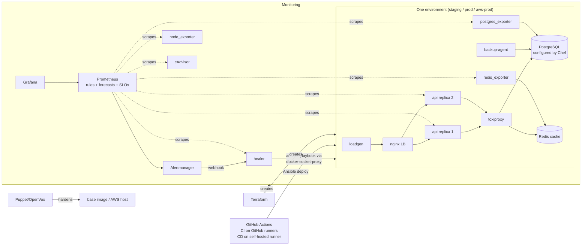
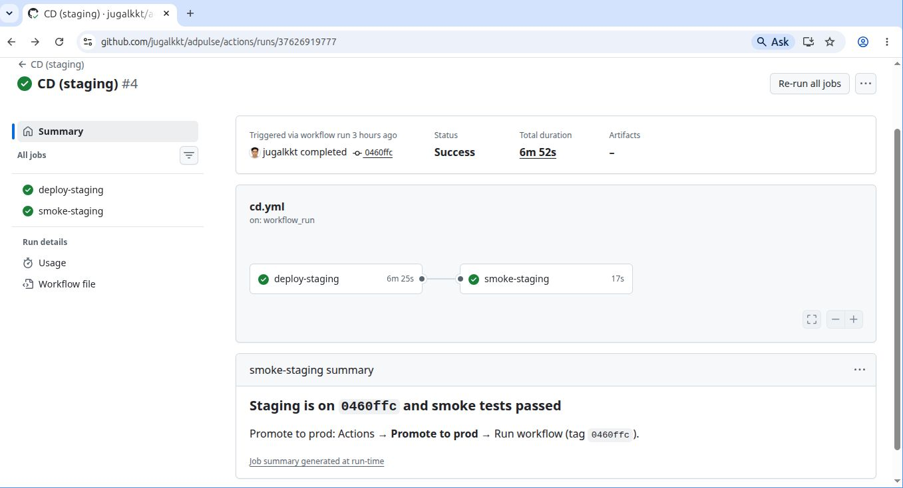
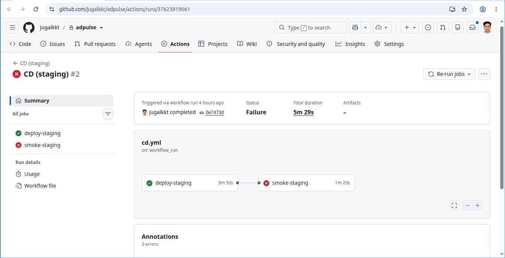
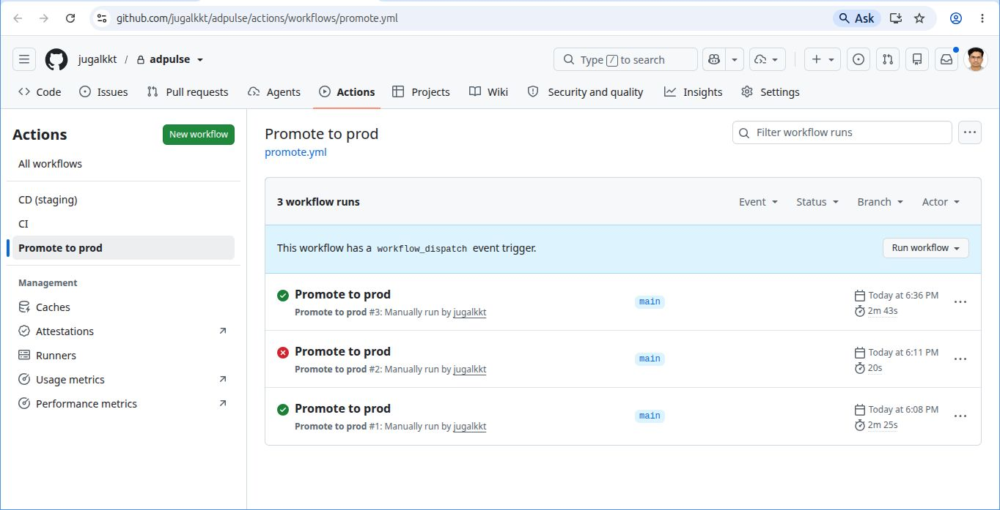
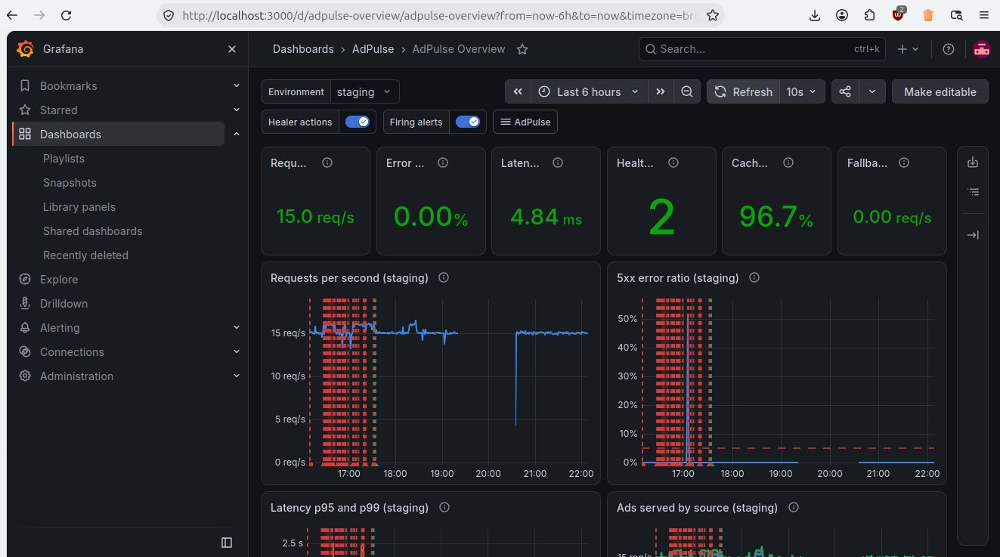
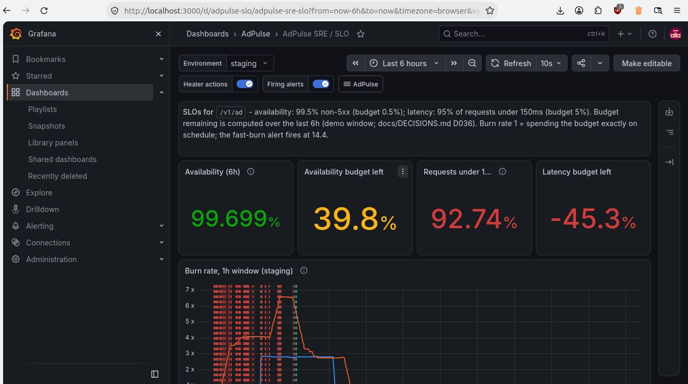
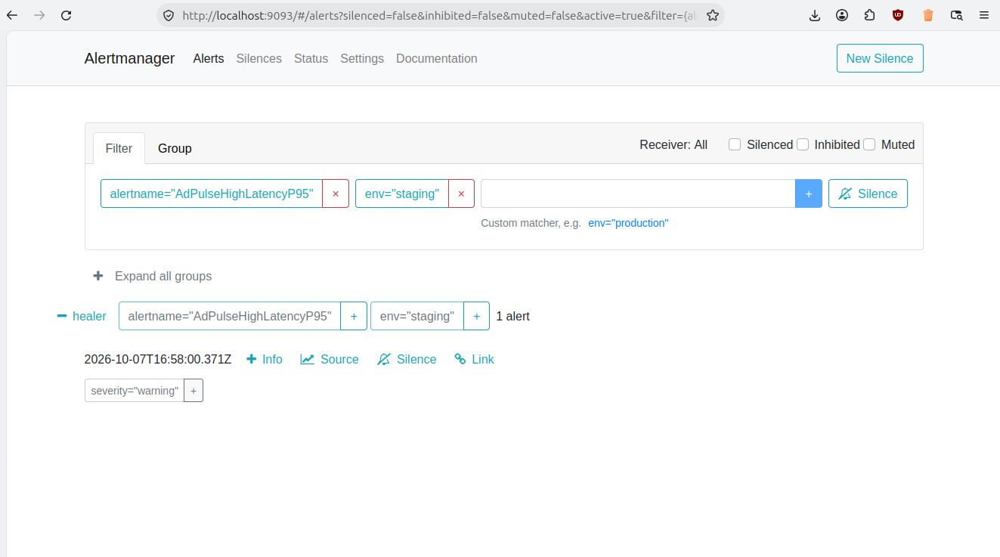
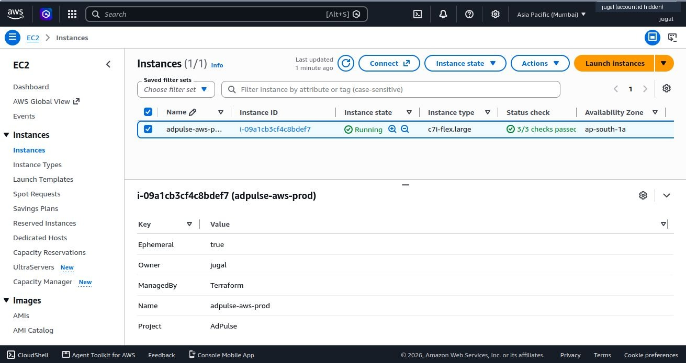

# AdPulse: a self-healing ad-serving platform

AdPulse is a small ad-serving API (FastAPI, PostgreSQL, Redis, nginx) built as a lab for site reliability engineering. Around the app is the machinery that keeps it running:

- **Terraform** creates the infrastructure.
- **Puppet (OpenVox)** and **Chef (Cinc)** configure the images and hosts.
- **Ansible** ships zero-downtime releases and runs the repairs.
- **Prometheus, Alertmanager and Grafana** watch it, with SLOs and trend forecasts.
- A **healer** fixes common failures automatically.

To prove it works, a chaos tool broke the system **16 times** across hardware, software, database and network. Every run was measured (MTTD/MTTR) and written up as a root cause analysis. The same Terraform modules then ran the production stack on AWS EC2 for one afternoon, under the same chaos tests, before everything was destroyed the same day.

*Built from scratch by Jugal over one long day (2026-10-07), with Claude Code as a pair programmer, as preparation for an SRE internship. All numbers below were measured in this repo.*



## Architecture



Details are in [docs/ARCHITECTURE.md](docs/ARCHITECTURE.md): request path, who owns what, release flow, and the two layers of healing.

## Results

### Chaos experiments: detection and recovery

From [docs/rca/SUMMARY.md](docs/rca/SUMMARY.md). MTTD = fault → alert firing. MTTR = fault → healthy again (3 good probes in a row). "Failed probes" are non-200 responses seen through nginx at 1 request per second.

| Scenario | Layer | Env | Detected by | Fixed by | MTTD | MTTR | Failed probes |
|---|---|---|---|---|---|---|---|
| replica-down | software | staging | AdPulseApiReplicaDown | healer: restart_api | 20.6 s | 42.7 s | 0 / 46 |
| replica-down | software | **aws-prod** | AdPulseApiReplicaDown | healer: restart_api | 28.9 s | 52.1 s | 0 / 56 |
| api-hang | software | staging | AdPulseApiReplicaDown | healer: restart_api | 24.3 s | 56.1 s | 0 / 47 |
| error-burst | software | staging | AdPulseHighErrorRate | healer: rolling restart | 74.4 s | 105.5 s | 52 / 108 |
| db-down (1st run) | database | staging | AdPulseDatabaseDown | **not healed**: the alert flapped | 22.0 s | n/a | 0 / 603 (593 house ads) |
| db-down (after fix) | database | staging | AdPulseDatabaseDown | healer: restart_db | 18.0 s | 37.5 s | 0 / 40 |
| db-down | database | prod | AdPulseDatabaseDown | healer: restart_db | 22.1 s | 40.4 s | 0 / 43 |
| db-down | database | **aws-prod** | AdPulseDatabaseDown | healer: restart_db | 20.9 s | 40.2 s | 0 / 44 |
| cache-down | database | staging | AdPulseCacheDown | healer: restart_cache | 24.0 s | 43.5 s | 0 / 46 |
| cache-down | database | prod | AdPulseCacheDown | healer: restart_cache | 16.0 s | 34.4 s | 0 / 37 |
| mem-leak | hardware | staging | ApiContainerMemoryHigh | healer: restart_api | 62.2 s | 88.0 s | 0 / 91 |
| cpu-hog | hardware | staging | HostHighCPU | healer: kill_noisy_neighbor | 106.3 s | 137.6 s | 0 / 140 |
| disk-quota | capacity | staging | BackupQuotaWillFillSoon (forecast) | healer: cleanup_backups | 137.3 s | 353.0 s | 0 / 356 |
| net-latency (Redis) | network | staging | **not detected** | contained by the 200 ms timeout | n/a | n/a | 0 / 304 |
| net-latency (data path) | network | staging | AdPulseHighLatencyP95 | healer collected evidence; a human fixed it | 134.2 s | 175.4 s | 0 / 152 |
| bad release | CI/CD | staging | CD smoke test | CD automatic rollback | 103.7 s | 150.7 s | 0 / 138 |

What the table shows:
- **15 of 16 faults were detected; 13 recovered with no human.**
- In every database outage **after the alerting fix, 0 probes failed**: the API served house ads instead of errors.
- The two failures in the table are documented honestly in their RCAs. In the first db-down, the alert flapped and was never delivered; [the fix](docs/DECISIONS.md) took MTTR to 37.5 s. Redis-only latency was not detected, and that detection gap is recorded as such.

### Other measurements

| What | Result |
|---|---|
| Rolling deploys and rollback under load | **0 failed requests** (6654/6654, 5765/5765, 4613/4613; rollback 4328/4328) |
| Bad release pushed to `main` | CD smoke test failed → automatic rollback in 46 s → prod untouched |
| Idempotency | Puppet apply #2: 0 changes · Chef converge #2: 0/10 · redeploying the same tag: every task skipped |
| Security scans | 0 fixable CRITICAL or HIGH CVEs in 5 images · gitleaks: no leaks in the full history |
| Container hardening (27 containers) | 27/27 drop all capabilities and no-new-privileges · 26/27 read-only root fs · 25/27 non-root |
| Memory | 5,056 MB of limits for everything (cap: 6 GB) |
| AWS (c7i-flex.large, ap-south-1) | 11 AWS + 36 Docker resources · smoke test 4/4 from the internet (p95 98 ms) · 9/9 targets up · destroyed the same day, verified empty with the AWS CLI |

## JD coverage

| Requirement | How AdPulse covers it | Evidence |
|---|---|---|
| Highly available systems | 2 replicas per env behind nginx, health and readiness checks, rolling deploys, house-ad fallback | [ARCHITECTURE](docs/ARCHITECTURE.md), [rolling_update.yml](ansible/playbooks/tasks/rolling_update.yml) |
| Resilience / business continuity | Chef-managed Postgres backups with metrics, self-healing, automatic rollback | [adpulse_db](config/chef/cookbooks/adpulse_db/), [rollback.yml](ansible/playbooks/rollback.yml) |
| Troubleshooting hardware, software, DB, network + RCA | 10 chaos scenarios at 4 layers; 16 RCAs | [chaos.py](chaos/chaos.py), [docs/rca/](docs/rca/) |
| Proactive monitoring, alerting, trends | Prometheus, 14 alerts with runbooks, `predict_linear` forecasts, SLO burn-rate alerts, Grafana | [monitoring/](monitoring/), [runbooks](docs/runbooks/) |
| Self-healing | healer: an allow-list of Ansible playbooks, cooldowns, escalation | [healer/](healer/), [heal playbooks](ansible/playbooks/heal/) |
| Continuous delivery, staging and prod | CI → CD to staging → smoke → promote to prod, automatic rollback | [.github/workflows/](.github/workflows/) |
| Automating manual work | `make up`, healer, `make chaos` / `make rca`, deploy and rollback | [Makefile](Makefile) |
| Security and compliance | Puppet hardening, non-root read-only containers, Trivy, gitleaks, SBOMs, scram-sha-256, IMDSv2, a /32 security group | [SECURITY.md](docs/SECURITY.md) |
| **Puppet** | OpenVox hardens the base image and the AWS host | [config/puppet/](config/puppet/) |
| **Chef** | Cinc configures the PostgreSQL node, backups, and the AWS host's DB side | [config/chef/](config/chef/) |
| **Ansible** | releases, rollbacks, healing, AWS bootstrap | [ansible/](ansible/) |
| **Terraform** | local Docker infra (staging/prod workspaces, shared modules) and AWS | [infra/terraform/](infra/terraform/) |

## Quickstart

Requirements: Ubuntu with Docker, Terraform, Ansible and the other tools installed by `scripts/bootstrap.sh` (exact versions in [VERSIONS.md](docs/VERSIONS.md)).

```bash
make up          # secrets, build, monitoring, staging + prod, deploy, smoke tests
make urls        # Grafana :3000, Prometheus :9090, Alertmanager :9093, prod :8080, staging :8081
make grafana-token && make monitoring   # first run only: lets the healer write Grafana annotations

curl -s '127.0.0.1:8080/v1/ad?category=sports&segment=student'
make chaos SCENARIO=db-down ENV=staging  # break something; watch it heal in Grafana
make rca ID=incidents/<newest dir>       # write the RCA for that run
make help                                # every target
```

`make up` was tested on a running system and from partially destroyed stacks (monitoring and staging gone, prod without API replicas): exit 0 in 331 s, both smoke tests pass. A full from-scratch test (no images, no volumes) was not completed, because `make down` has a known ordering issue ([D068](docs/DECISIONS.md)).

## Screenshots

| | |
|---|---|
|  CD: deploy to staging, then smoke |  A bad release, rolled back automatically |
|  The manual promotion to prod |  A healer action as a Grafana annotation |
|  The SLO and error-budget dashboard |  Alertmanager during a chaos run |
|  The EC2 instance and its tags (account ID redacted) | |

## Tech stack

| Area | Tools (pinned versions in [VERSIONS.md](docs/VERSIONS.md)) |
|---|---|
| App | Python 3.12, FastAPI 0.142.2, uvicorn 0.54.0, psycopg 3.3.6, redis-py 8.1.0, prometheus-client 0.26.0 |
| Data and edge | PostgreSQL 18.6, Redis 8.10.2, nginx 1.30.5 (unprivileged), Toxiproxy 2.12.0 |
| Infrastructure | Docker 29.8.2, Terraform 1.16.5 (docker provider 4.6.0, aws provider 6.67.0) |
| Configuration | Puppet (OpenVox 8.29.0), Chef (Cinc 19.3.14), Ansible 14.5.0 (core 2.21.5) |
| Observability | Prometheus 3.15.0, Alertmanager 0.34.1, Grafana 13.2.3, node-exporter 1.12.1, cAdvisor 0.60.6 |
| CI/CD and security | GitHub Actions (actions pinned by SHA), Trivy 0.75.0, gitleaks 8.30.0, hadolint, actionlint, shellcheck, ruff |
| Cloud | AWS EC2 c7i-flex.large, VPC, security groups, IAM (ap-south-1) |

## Docs

- [ARCHITECTURE.md](docs/ARCHITECTURE.md): how it fits together
- [LEARNING.md](LEARNING.md): every tool explained from zero, with exercises and a 2-week study plan
- [INTERVIEW_PREP.md](docs/INTERVIEW_PREP.md): pitch, walkthrough, questions and answers
- [DECISIONS.md](docs/DECISIONS.md): 68 decisions with their reasons and alternatives
- [COMMIT_MAP.md](docs/COMMIT_MAP.md): old → new commit SHAs (the history was rewritten before publishing)
- [SECURITY.md](docs/SECURITY.md): each control, where it lives and how it was verified
- [docs/rca/](docs/rca/) and [docs/runbooks/](docs/runbooks/): incidents and the response for every alert

## What I'd do next

1. **Close the detection gaps:** alert on cache-latency SLIs (the Redis-only latency fault went undetected) and on the error-budget burn caused by house ads, not just on 5xx.
2. **Fix `make down`'s cross-stack links** (D068) and run the full from-scratch test in CI on a throwaway VM.
3. **Real HA for the data tier:** a Postgres replica with automatic failover (Patroni or RDS Multi-AZ) and Redis Sentinel. Today one Postgres is a single point of failure, which the house ads only hide.
4. **Run on Kubernetes or ECS** across 2+ hosts, so a host failure is survivable. Replace the custom healer's restart logic with the orchestrator's, and keep the healer for things orchestrators can't fix.
5. **A registry and signed images** (ECR + cosign) instead of `docker save`, plus remote Terraform state with locking (S3).
6. **Ship logs as well as metrics** (Loki or OpenSearch), and trace requests end to end with OpenTelemetry.

## CI/CD

- **CI** (`.github/workflows/ci.yml`, GitHub-hosted runners, every push and PR): lint, tests (Postgres/Redis service containers), image builds, security scans (Trivy, gitleaks).
- **CD** (`.github/workflows/cd.yml`, the laptop's self-hosted runner): after CI succeeds on a **push to `main`**, build, roll out to **staging**, run the smoke test, and roll back automatically if it fails.
- **Promote** (`.github/workflows/promote.yml`): the manual approval gate. *Actions → Promote to prod → Run workflow* deploys the release staging currently runs, then smoke-tests prod and rolls back automatically if that fails.

### Self-hosted runner: security notice
CD and Promote ran on a self-hosted runner on the developer's laptop (with Docker access and the `.env` secrets) while the repo was private. **That runner was removed before the repo was made public**, so those two workflows no longer have anywhere to run. CI still runs on GitHub-hosted runners.
- Never register a self-hosted runner on a **public** repo: a pull request from a fork could run code on that machine.
- To use CD again, fork the repo as **private** and register your own runner (labels `self-hosted, Linux, X64, adpulse-local`).
