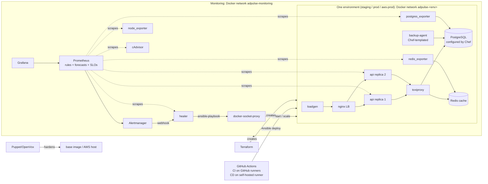

# Architecture

AdPulse is an ad-serving API (FastAPI, PostgreSQL, Redis, nginx). Around it is the machinery that keeps it running: infrastructure as code, configuration management, monitoring, self-healing, chaos experiments and CI/CD. The same Terraform modules run three environments: **staging** and **prod** on the laptop, and **aws-prod** on one EC2 VM. The VM was deployed, tested and destroyed on 2026-10-07.

## Diagram

## Request path

1. The client (or `loadgen`) calls `GET /v1/ad?category=…&segment=…` on nginx (`127.0.0.1:8080` prod, `:8081` staging, port 80 on AWS).
2. nginx balances across two API replicas. If a replica fails, it retries on the other one: connect timeout 500 ms, read/send 2 s (D032). nginx hides `/metrics` and `/admin/*` from outside (D028).
3. The API reads the candidate ads for that category and segment from Redis (TTL 60 s), or from PostgreSQL on a cache miss. It then picks one at random, weighted by `bid_cpm` (`app/adpulse/selection.py`).
4. **Graceful degradation:** if Redis or Postgres is slow or down, the API returns a *house ad* (fallback) with HTTP 200 instead of an error, and counts it as `adpulse_ad_served_total{source="fallback"}`.
5. Every hop to Postgres and Redis goes through **Toxiproxy**, so chaos experiments can add latency or cut connections on the real data path.

`/healthz` means the process is alive. `/readyz` means it can serve: the DB pool and Redis are reachable, and it returns 503 when not. The deploy gate and the smoke tests use `/readyz`.

## Who owns what (no overlap)

| Tool | Owns | Lives in |
|---|---|---|
| **Terraform** | networks, volumes and every long-lived container (Postgres, Redis, Toxiproxy, nginx, backup-agent, exporters, loadgen, the monitoring stack, the healer); on AWS: VPC, subnet, security group, key pair, EC2 | `infra/terraform/` |
| **Puppet (OpenVox)** | OS baseline: `adpulse::base` is baked into the base image (the agent is purged afterwards); `adpulse::host` hardens the AWS VM (users, sshd, ufw, sysctl, unattended-upgrades) | `config/puppet/` |
| **Chef (Cinc)** | the database node: `postgresql.conf`, `pg_hba.conf`, backup scripts and retention, baked into the Postgres image; on the VM: backup directory and Docker log rotation | `config/chef/` |
| **Ansible** | releases (migrations, rolling deploy, rollback, smoke); all healing playbooks; AWS bootstrap (Docker, Puppet, Chef, image transfer) | `ansible/` |
| **GitHub Actions** | CI (lint, test, build, scan) and CD (calls the same Ansible deploy) | `.github/workflows/` |
| **Make** | the single entry point for humans | `Makefile` |

The API containers are the only thing Terraform does **not** create, because releases are Ansible's job. Terraform does create the network alias `api-<env>` that they join, and nginx resolves that alias.

## Environments

| | staging | prod | aws-prod |
|---|---|---|---|
| Entry | `127.0.0.1:8081` | `127.0.0.1:8080` | EC2 port 80, from Jugal's IP /32 only |
| Docker network | `172.28.10.0/24` | `172.28.20.0/24` | `172.28.30.0/24` |
| API replicas | 2 | 2 | 2 |
| Chaos HTTP endpoints | enabled (token) | disabled | disabled |
| Loadgen | 15 rps | 25 rps | 5 rps |
| Deployed by | CD on every green push to `main` | the "Promote to prod" workflow (manual) | `make aws-deploy` |

Monitoring has its own network, `172.28.1.0/24`. Prometheus joins each environment network to scrape it, and finds API replicas through DNS service discovery on `api-<env>`.

## Release flow (rolling, zero downtime)

`ansible/playbooks/deploy.yml`, for each replica in turn:

1. Run expand-only migrations once (D030).
2. Start `api-<env>-N-next` with the same network alias.
3. Wait for the Docker health check, then for **`/readyz` = 200** (the readiness gate, D060).
4. Pause 6 s so nginx has picked up the new replica.
5. Stop the old replica, rename `-next` to the fixed name, then pause 6 s again.
6. Write `deploy/state/<env>.json` (`current`, `previous`). `make rollback` deploys `previous` the same way.

Measured: 0 failed requests in every deploy and rollback under load (Phase 6: 6654/6654, 5765/5765, 4613/4613, rollback 4328/4328).

CI/CD: push → **CI** (GitHub-hosted: lint, tests, image builds, Trivy and gitleaks) → **CD** (self-hosted runner on the laptop: deploy staging → smoke → automatic rollback on failure) → **Promote to prod** (manual button: deploys exactly staging's release → smoke → automatic rollback).

## Healing flow (two layers)

1. **Docker** restarts a container whose process exits (`restart: unless-stopped`), and health checks mark a hung one unhealthy.
2. **Prometheus → Alertmanager → healer** handles everything Docker can't see: a replica that is missing, a database that is down, a forecast that the backup volume will fill, a noisy neighbour, a high error rate. `healer/healing.yml` is an allow-list mapping each alert to a playbook in `ansible/playbooks/heal/`. Each mapping has a cooldown, a maximum number of attempts per window, and **escalation**: `HealerEscalated` pages a human instead of retrying forever. A per-env lock allows only one heal action at a time in each environment, and a deploy creates an Alertmanager silence for its env, so the healer never "fixes" a replica that a deploy is replacing on purpose.

The healer has no Docker socket. It talks to `docker-socket-proxy`, which allows only the container API calls it needs, over an internal network (D043). Every action goes to `incidents/heal-log.jsonl` and becomes a Grafana annotation.

## Monitoring

- Prometheus scrapes every 5 s (a demo setting, D035) and loads `rules/recording.yml`, `rules/alerts.yml` (14 alerts, each with a runbook in `docs/runbooks/`) and `rules/slo.yml`.
- SLOs: availability 99.5 % and latency (95 % of requests under 150 ms), with multi-window fast and slow burn-rate alerts (D036).
- Trend: `predict_linear` on the backup volume drives `BackupQuotaWillFillSoon` before it is full.
- Grafana dashboards are generated by `monitoring/grafana/build_dashboards.py` (Overview, SRE/SLO, Incidents).

## Resources

27 containers locally (both envs plus monitoring), all memory-limited: **5,056 MB in total, under the 6 GB cap.** Every container, volume and network is labelled `com.adpulse.project=adpulse`, and cleanup commands filter by that label.

## AWS (aws-prod)

One `c7i-flex.large` in ap-south-1 runs the **same** `adpulse_stack` and `monitoring_stack` modules. Terraform drives the VM's Docker over SSH, and images are copied with `docker save | gzip`, so there is no registry. Ansible bootstraps the host: Docker, then Puppet `adpulse::host`, then Chef `adpulse_db::host`, each run twice to prove idempotency. Only 22 and 80 from one /32 are open, IMDSv2 is required, and the disk is encrypted. Everything was destroyed the same day (`make aws-down`, D063–D067).
